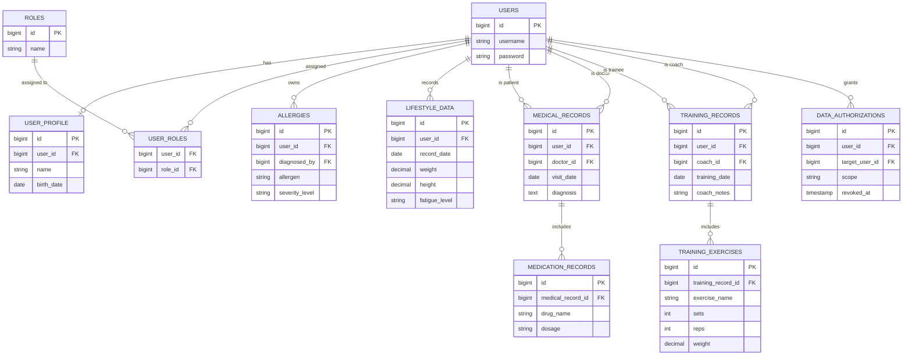

# BioBehaviorBridge (BBB)

## 專案簡介

BioBehaviorBridge 是一套跨機構健康資料整合系統，目標是讓使用者只需攜帶一個帳號（未來可擴充至健保卡、護照等身分憑證），
無論在世界哪個角落就醫，醫生都能即時讀取其過去病史、用藥紀錄，以及日常生活數據（運動頻率、疲勞程度、飲食習慣等），協助快速且精準地判斷治療方式。

系統採用「病人自主授權」模式：使用者可自由決定將哪些範圍的資料（醫療端 / 生活端 / 教練端）分享給哪些醫生或教練，並可隨時撤銷授權。
撤銷不會刪除歷史紀錄，僅停止未來的資料存取，確保稽核軌跡完整。

除醫生端外，系統也規劃了教練端：教練可依使用者授權，整合其可公開的疾病資訊與生活數據，規劃最適合的運動方案。

## 技術棧

- Java 25 (Eclipse Temurin)
- Spring Boot 4.0.6
- Spring Security + JWT
- Spring Data JPA / Hibernate
- PostgreSQL 15
- Flyway（資料庫版本控管）
- Redis（快取層）
- Docker / Docker Compose

## 系統架構

- 三層式架構：Controller → Service → Repository
- 認證：JWT（Access Token 15 分鐘 / Refresh Token 7 天）
- 授權模型：RBAC（使用者可擁有多重角色：USER / DOCTOR / COACH）+ 細粒度資料授權表（data_authorizations），兩者分層檢查
- 資料不可變原則：生活數據、醫療紀錄採 append-only 設計，只新增不覆蓋，確保歷史資料可追溯
- 授權撤銷採軟刪除設計（revoked_at 欄位 + Partial Unique Index），保留完整稽核軌跡

## 專案結構

```
src/main/java/com/linalingling/bbb/
├── BbbApplication.java
├── config/
│   ├── SecurityConfig.java        # JWT 驗證、CORS 設定
│   └── RedisCacheConfig.java      # Redis CacheManager 設定
├── security/                      # JWT 全套（JwtUtils / Filter / UserPrincipal）
├── entity/                        # User / Role（認證）+ UserProfile / Allergy /
│                                     LifestyleData / MedicalRecord / MedicationRecord /
│                                     DataAuthorization / TrainingRecord / TrainingExercise
├── repository/                    # 對應以上 Entity 的 Spring Data JPA Repository
├── service/                       # 業務邏輯層，含授權檢查、UPSERT 邏輯、Redis 快取
├── controller/                    # RESTful API 端點
├── dto/                           # Request DTO，含 Bean Validation
└── exception/

src/main/resources/
├── application.yaml
└── db/migration/                  # V1（認證，模板內建）～V7（授權表）
```
## ERD




## 本機啟動步驟

### 方式一：Docker Compose（推薦，一鍵啟動）

\`\`\`bash
docker-compose up --build
\`\`\`

會同時啟動 app（8080）、PostgreSQL（5432）、Redis（6379）三個容器，Flyway 會自動建立完整 schema。

### 方式二：本機手動啟動

1. 啟動 PostgreSQL 容器：
   \`\`\`bash
   docker run -d --name my_postgres -e POSTGRES_USER=my_postgres -e POSTGRES_PASSWORD=password123 -p 5432:5432 postgres:15
   docker exec my_postgres psql -U my_postgres -d postgres -c "CREATE DATABASE starter_db;"
   \`\`\`

2. 啟動 Redis 容器：
   \`\`\`bash
   docker run -d --name my_redis -p 6379:6379 redis:7
   \`\`\`

3. 執行專案：
   \`\`\`bash
   ./mvnw spring-boot:run
   \`\`\`

## API 清單

| 方法 | 路徑 | 說明 |
|---|---|---|
| POST | /api/auth/register | 註冊 |
| POST | /api/auth/login | 登入（回傳 accessToken + refreshToken） |
| POST | /api/auth/refresh | 換發 Access Token（Refresh Token 會輪換） |
| POST | /api/auth/logout | 登出（撤銷 Refresh Token） |
| PUT | /api/user-profiles | 建立/更新個人資料（Upsert） |
| PUT | /api/lifestyle-data | 記錄每日生活數據（Upsert，欄位可部分更新） |
| POST | /api/allergies | 新增過敏紀錄（醫生填寫） |
| GET | /api/allergies/patient/{patientId} | 查詢病人過敏紀錄 |
| GET | /api/medical-records/patient/{patientId} | 醫生查詢病人醫療紀錄（含 Redis 快取、授權檢查） |
| POST | /api/authorizations | 病人授權醫生/教練存取資料 |
| DELETE | /api/authorizations | 撤銷授權（軟刪除，保留歷史紀錄） |

## 安全性設計

- 所有涉及個人資料的 API，使用者身分一律來自 JWT Token（`@AuthenticationPrincipal`），前端無法偽造 userId
- 醫療資料存取採雙層檢查：Spring Security 角色檢查（是否具備對應角色）+ Service 層細粒度授權檢查（是否被該病人明確授權）
- Redis 快取 key 組合 doctorId + patientId，避免不同醫生間快取互相繞過授權檢查
- 五個核心 Service 均加上 `@Transactional`，確保跨步驟資料庫操作（查詢 → 修改 → 存檔）的一致性

## AI 協作說明

開發過程使用 Claude 作為 Socratic 式導師進行架構討論與程式碼實作，以下為幾個 AI 初始建議經我發現問題後修正的具體案例：

**案例一：授權表 UNIQUE 約束未考慮「撤銷後重新授權」情境**
最初設計 `data_authorizations` 表時，直覺想法是用一般的 `UNIQUE(user_id, target_user_id, scope)` 約束防止重複授權。
但深入討論後發現：一般 UNIQUE 約束會導致「撤銷後無法對同一位醫生重新授權」（因為舊紀錄雖已標記撤銷仍佔用該組合）。
最終改用 PostgreSQL 的 Partial Unique Index：

\`\`\`sql
CREATE UNIQUE INDEX idx_active_authorization
ON data_authorizations (user_id, target_user_id, scope)
WHERE revoked_at IS NULL;
\`\`\`
只對「目前有效」的授權要求唯一性，已撤銷的歷史紀錄不受限制，同時保留完整稽核軌跡。

**案例二：lifestyle_data 與 users 的關聯基數判斷錯誤**
撰寫 Entity 時，一開始誤將 `LifestyleData` 對 `User` 的關係寫成 `@OneToOne`，理由是「一個人一天一筆」。
但實際上一個使用者會累積多天、多筆生活數據紀錄，`@OneToOne` 代表「一個使用者在此表中僅能有一列」，與實際情境矛盾。
真正的「一天一筆」限制應由 `UNIQUE(user_id, record_date)` 這個資料庫層級約束處理，而非 Entity 關係基數本身；正確關係應為 `@ManyToOne`。

**案例三：is_relaxed 欄位型別選擇（boolean vs Boolean）**
撰寫 `LifestyleData` Entity 時，`is_relaxed`（是否有放鬆）最初使用 Java 原始型別 `boolean`。
但此欄位在資料庫設計上刻意允許 NULL（使用者當天可能未填寫此項），而原始型別 `boolean` 僅能表示 true/false，無法表示「未填寫」。
改用包裝類別 `Boolean` 後才能正確對應資料庫的 nullable 欄位語意。

## 未來規劃

- 教練端（training_records / training_exercises）資料表已完成設計並建立於資料庫 schema 中，考量開發時程，
- 本次繳交版本優先完整實作醫生-病人授權主線；教練端 API 可直接沿用相同的 `data_authorizations` 授權模式擴充，無需更動資料庫結構
- 快取撤銷聯動：授權撤銷時主動清除相關快取（目前為簡化版本，快取存活期間內即使授權被撤銷仍可能取得快取結果）